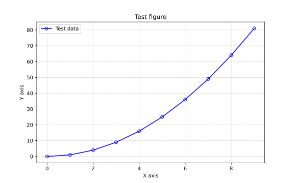
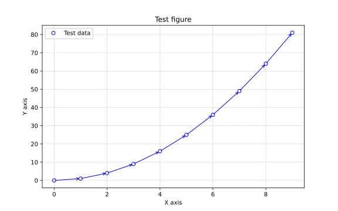

# pltex
`pltex` (Matplotlib Extended) is a tool to aid programmers in creating Matplotlib figures quicker and easier. It is intended to remove a lot of the boilerplate involved in creating plots using Matplotlib. It also includes additional features, such as the ability to save .pltex files, which are serialised `Figure` objects, with the intention of being able to view these as _interactive figures_.

# Features
## Axis and legend labels
With pltex, there is no need to call ax.set_xlabel, ax.set_ylabel or ax.legend(). Axis labels can be set directly in the `plot` call. The legend can be enabled with `legend_on` in the instantiation of a `Figure`. The legend can be programmatically removed from a given subplot using fig.remove_legend().

```
from pltex import Figure, np

fig = Figure(title="Test figure", figsize=(8, 5), legend_on=True) # Turn on legend
x = np.array(list(range(10)))
fig.plot(
    x, x**2, "bo-",
    xlabel="X axis", ylabel="Y axis", label="Test data" # Set axis labels in plot() call
)
fig.show() # Mark figure as visible
Figure.display() # Display all figures marked as visible
```


## Arrow (`->`) marker format
Included in pltex is a custom marker format: `->`. Similar to native matplotlib where `fmt="-"` draws lines between points, setting `fmt="->"` will draw arrows between points. This is especially useful when the direction of data matters (e.g., indicating increasing direction of an independent variable).
```
fig.plot(
    x, x**2, "bo->",
    xlabel="X axis", ylabel="Y axis", label="Test data" # Set axis labels in plot() call
)
```


## Daughter plots
TODO
